# Relazione

Questo progetto mira a espandere e migliorare il progetto originario [Maze](https://github.com/Tugamer89/maze), implementando un motore di rendering 3D nativo basato su **OpenGL**. Inoltre, è stata integrata la libreria [ImGui](https://github.com/ocornut/imgui) per fornire un'interfaccia grafica intuitiva (GUI) utile alla gestione in tempo reale dei parametri di scena.

Il gameplay si sviluppa in prima persona: l'obiettivo del giocatore è fuggire nel minor tempo possibile da un labirinto generato proceduralmente a ogni partita, orientandosi esclusivamente tramite l'ausilio di una minimappa.

## Tappe

### Stage 1 (v0.2.x)

L'obiettivo di questa prima fase è stato predisporre un ambiente di sviluppo solido. È stato configurato un template di base che include correttamente [ImGui SFML](https://github.com/SFML/imgui-sfml) affiancato al codice necessario per gestire un primo spazio tridimensionale tramite **OpenGL**.

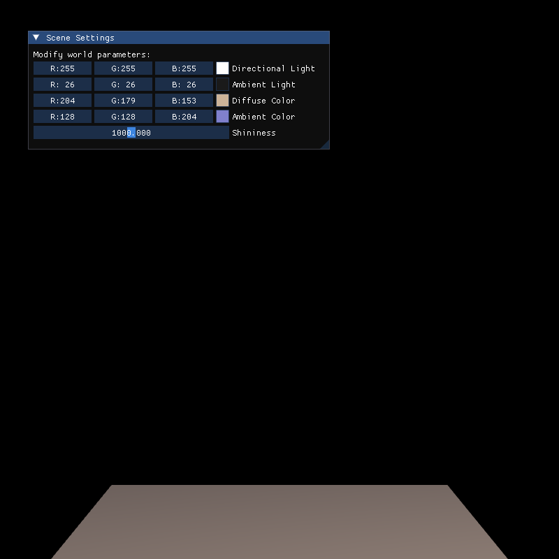

In questo stage viene visualizzato un semplice pavimento, ruotabile liberamente trascinando il cursore con il tasto sinistro del mouse. È presente inoltre un pannello GUI rudimentale per testare la modifica in tempo reale di alcuni parametri visivi.

### Stage 2 (v0.3.x)

Il focus si è spostato sulla generazione della griglia di base del labirinto. Per ora la struttura è riempita interamente di muri e posizionata al centro dell'origine degli assi. Questa modifica ha richiesto una transizione architetturale da una scena a singolo oggetto a una scena complessa gestita tramite un **grafo di scena**.

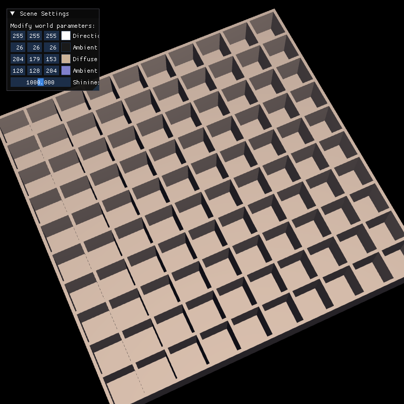

Il risultato visivo è una griglia completa esplorabile spostando la telecamera tramite input del mouse.

### Stage 3 (v0.4.x)

La generazione della mappa è stata implementata con la logica di un vero e proprio labirinto. È stato adottato un [algoritmo](https://en.wikipedia.org/wiki/Maze_generation_algorithm#Iterative_implementation_(with_stack)) basato su una visita DFS randomizzata, che garantisce percorsi sempre diversi e completabili.

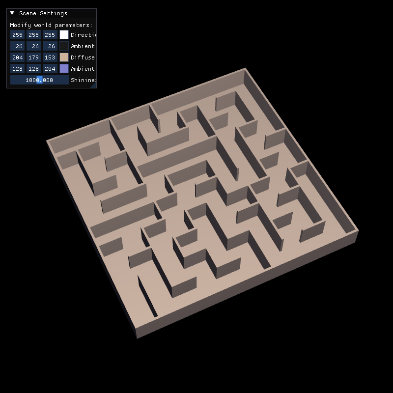

### Stage 4 (v0.5.x)

L'obiettivo di questa tappa è innalzare la fedeltà visiva applicando texture ad alta risoluzione ai modelli del labirinto. È stato sviluppato un sistema di materiali che utilizza, per ogni superficie, tre mappe:

* **Albedo (`diff`)**: per il colore base.
* **Roughness (`rough`)**: per determinare la ruvidezza del materiale e la dispersione dei riflessi.
* **Normal (`nor`)**: per manipolare le normali dei pixel, simulando micro-rilievi e restituendo un'illuminazione molto più realistica.

A fronte di queste novità, gli shader storici "Normal" e "Gouraud" sono stati rimossi in quanto obsoleti.

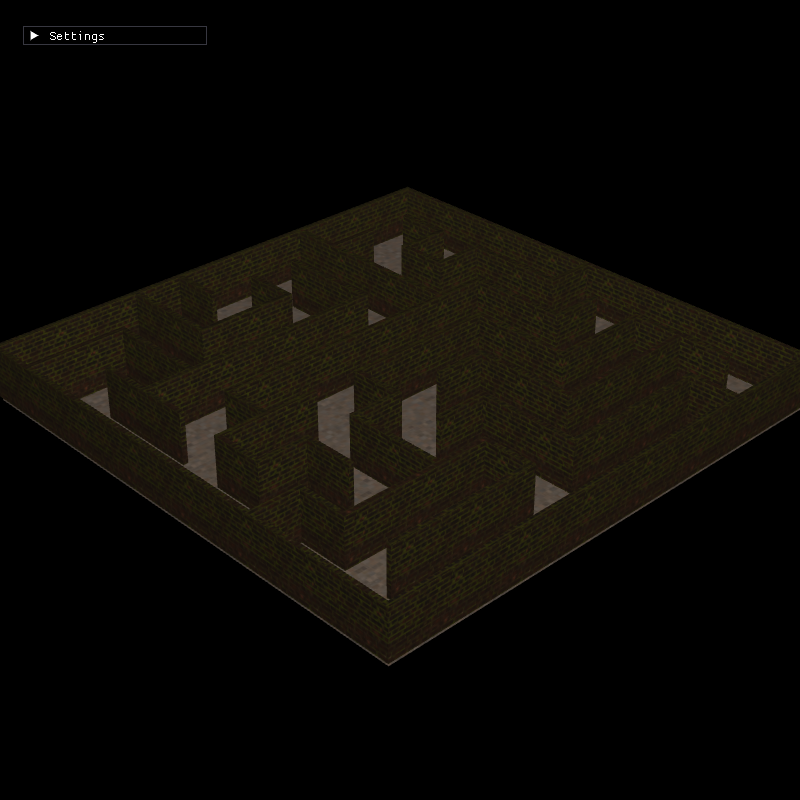

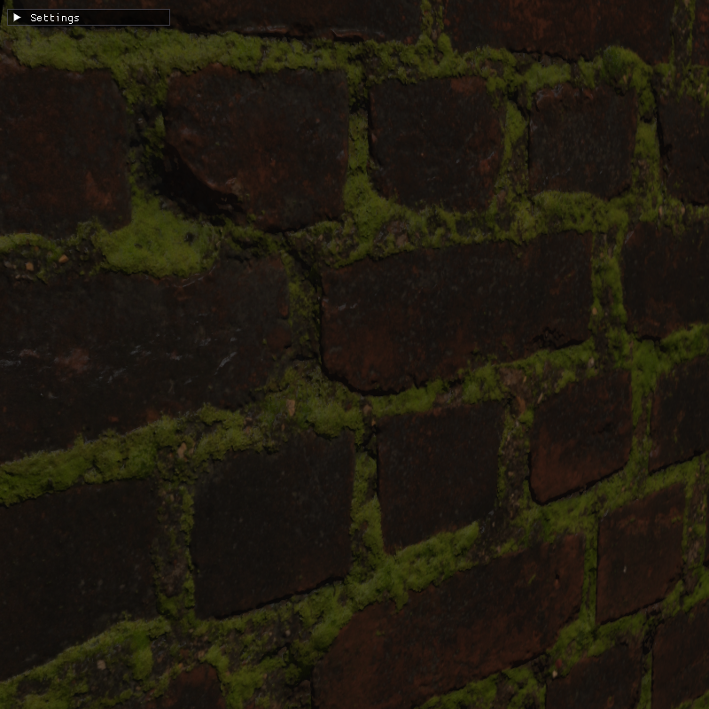

### Stage 5 (v0.6.x)

Sono state apportate migliorie all'interfaccia utente, aggiungendo un contatore degli FPS per monitorare le performance grafiche. È stata inoltre introdotta una schermata di caricamento progressiva per fornire feedback all'utente durante l'inizializzazione sincrona degli asset pesanti.

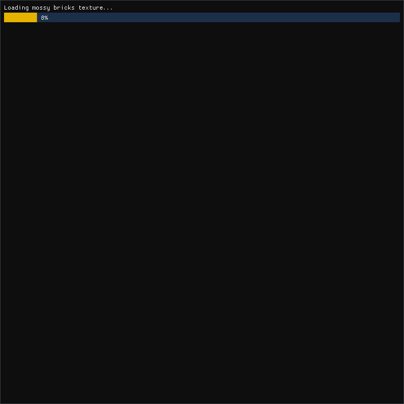

Parallelamente, il sistema di illuminazione Phong è stato fixato e raffinato per correggere fastidiosi artefatti visivi agli angoli dei muri.

| Prima (Spigoli rotti) | Dopo (Spigoli corretti) |
| :---: | :---: |
| 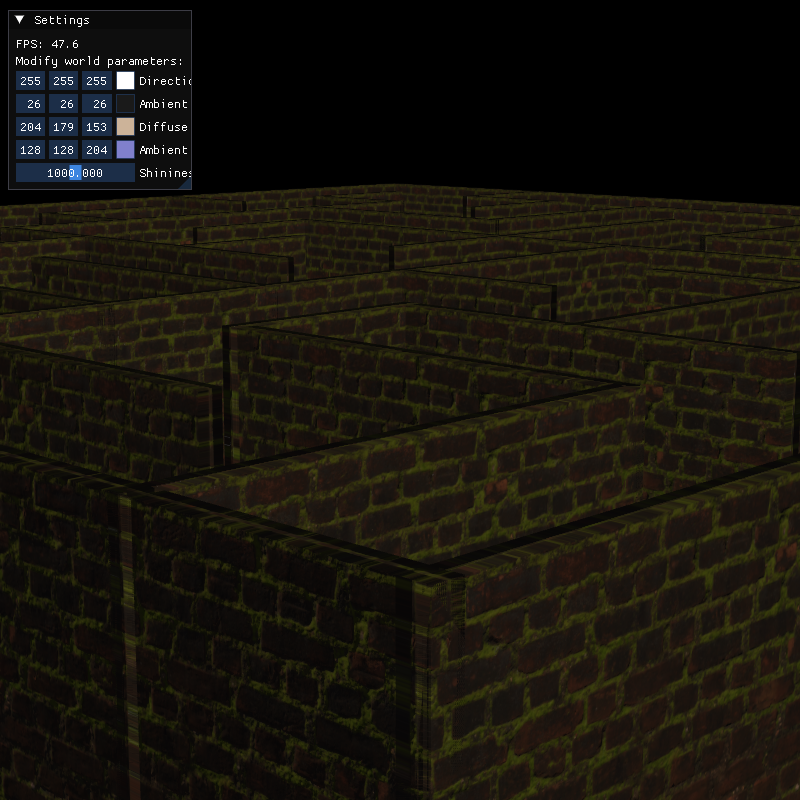 | 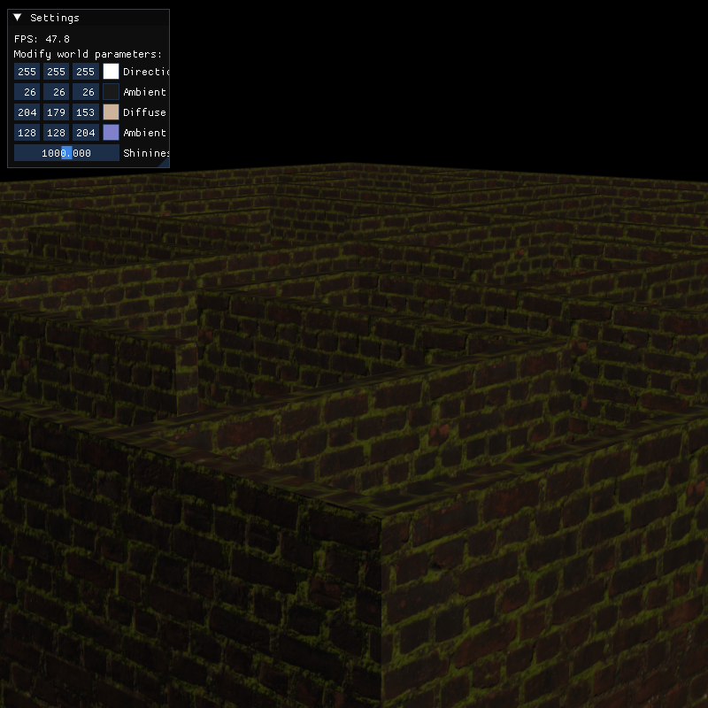 |

### Stage 6 (v0.7.x)

L'obiettivo di questa tappa è stata l'ottimizzazione radicale delle prestazioni.

Il **mapping triplanare** utilizzato nello stage precedente per applicare le texture costringeva il *Fragment Shader* a eseguire ben 9 campionamenti in memoria video per ogni singolo pixel a schermo (calcolando i 3 assi per le mappe di colore, normali e ruvidezza e poi fondendoli insieme).

Sfruttando la natura architettonica del labirinto, composto esclusivamente da pareti ortogonali perfettamente allineate agli assi cartesiani, la tecnica è stata sostituita con un più efficiente **Box Mapping** (*Single-Sample Dominant-Axis Mapping*). Lo shader ora identifica matematicamente l'asse dominante della faccia osservata ed effettua il campionamento delle texture una sola volta per quel piano specifico. Questa modifica ha ridotto il carico sulla memoria video del 66%, mantenendo intatto il fotorealismo ma garantendo un drastico aumento dei fotogrammi al secondo.

È stata inoltre implementata un'ottimizzazione architetturale lato CPU introducendo il pre-calcolo (*caching*) delle matrici di trasformazione. Poiché il labirinto è un elemento geometricamente statico, la *Model Matrix* e la relativa *Normal Matrix* di ciascun nodo dello *Scene Graph* vengono ora calcolate e salvate in memoria una sola volta in fase di inizializzazione. Questo approccio elimina migliaia di costose e ridondanti inversioni matriciali dal loop di rendering principale, alleggerendo drasticamente il carico sul processore.

L'implementazione combinata di queste due tecniche (riduzione dei campionamenti GPU e caching delle matrici su CPU) ha portato a un **incremento prestazionale misurato di circa 2.5x in termini di FPS**, garantendo un'esperienza visiva estremamente fluida senza alcun compromesso sul fotorealismo.

### Stage 7 (v0.8.x)

L'obiettivo principale di questa tappa è stata l'implementazione delle meccaniche di navigazione in prima persona (FPS), collocando fisicamente la telecamera all'interno della geometria del labirinto. Dal punto di vista architetturale, la gestione delle rotazioni e delle traslazioni spaziali è stata rifattorizzata: il calcolo della *View Matrix* è stato automatizzato sfruttando la funzione `glm::lookAt`, garantendo un codice nettamente più pulito e manutenibile.

Il sistema di illuminazione è stato contestualmente aggiornato per assecondare la nuova prospettiva. La sorgente luminosa puntiforme è ora posizionata di default con un offset che simula una torcia impugnata nella mano destra del giocatore. Le coordinate spaziali di questa luce dinamica sono state inoltre esposte all'interno dell'interfaccia GUI, permettendone la manipolazione in tempo reale.

Infine, il motore di rendering è stato bilanciato per favorire la fluidità e la qualità visiva in prospettiva:

* **Filtro Anisotropico**: È stato introdotto per contrastare la naturale perdita di dettaglio delle texture osservate con angolazioni oblique (situazione tipica dei lunghi corridoi in prima persona). Questa tecnica garantisce superfici distanti molto più nitide e leggibili.
* **Micro-ottimizzazioni**: La sincronizzazione verticale (V-Sync) e l'Anti-Aliasing (AA) sono stati disabilitati di default. Questa scelta mira ad abbattere l'overhead computazionale, massimizzando gli FPS e garantendo un'esperienza di gioco estremamente fluida e reattiva.

### Stage 8 (v0.9.x)

L'obiettivo di questo stage è stato un ulteriore perfezionamento delle performance, con particolare attenzione all'ottimizzazione del motore grafico per macchine dotate di hardware meno prestante. A tal fine, la pipeline di rendering è stata arricchita con due feature fondamentali:

* **Frustum Culling**: È stato implementato un sistema di scarto geometrico che evita di processare e inviare alla GPU i nodi del labirinto situati al di fuori del volume visivo (frustum) della telecamera. Poiché la visuale in prima persona all'interno dei corridoi limita naturalmente la visibilità, questa tecnica evita il rendering di una vasta quantità di geometria fuori campo. L'implementazione ha garantito un incremento prestazionale medio di circa **1.5x in termini di FPS**, con picchi di miglioramento nettamente superiori nelle inquadrature ad alta occlusione visiva.
* **Scalabilità Grafica Automatica**: È stato introdotto un sistema di gestione della qualità delle texture configurabile su tre livelli. Al primo avvio, l'applicativo effettua una stima delle performance per assegnare automaticamente il preset qualitativo più adeguato al sistema in uso. Le impostazioni (scelte dall'algoritmo o modificate dall'utente tramite GUI) vengono poi serializzate e salvate in locale per garantirne la persistenza tra le varie sessioni.

| Low | Medium | High |
| :---: | :---: | :---: |
| 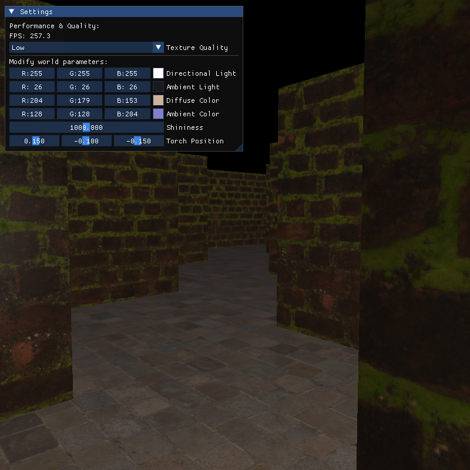 | 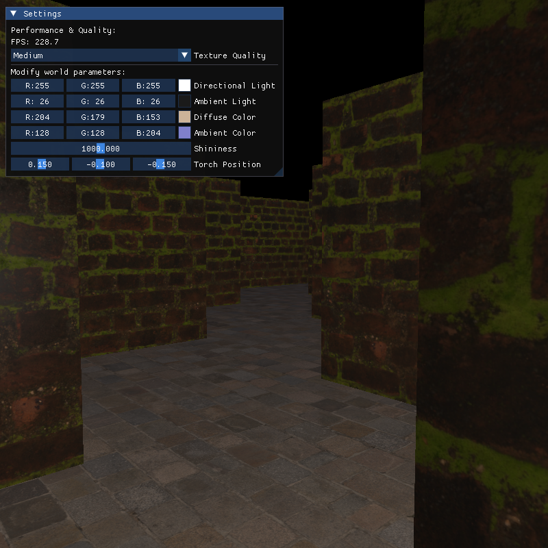 | 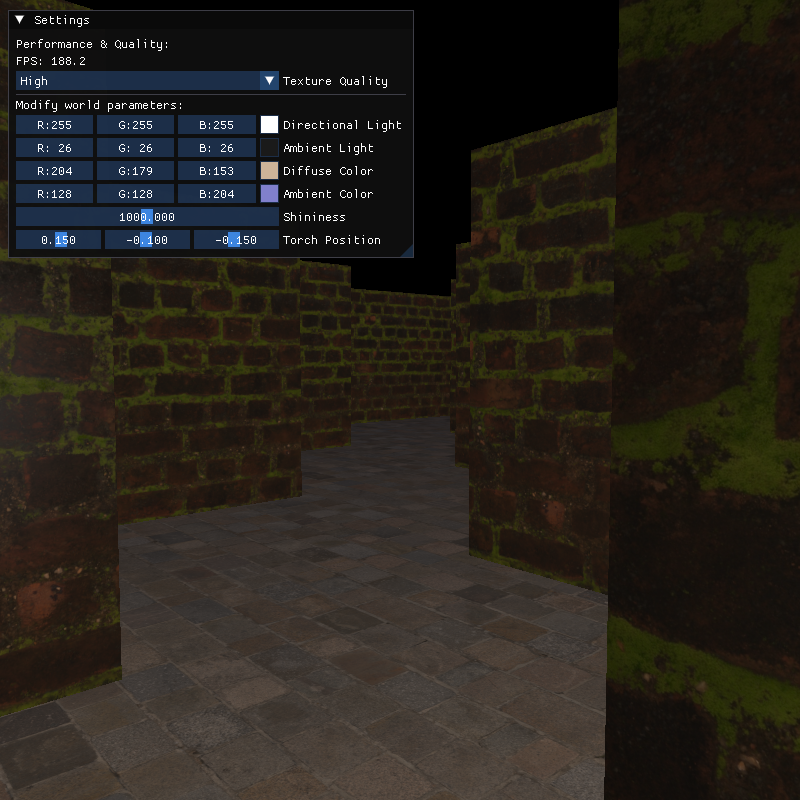 |

### Stage 9 (v0.10.x)

L'obiettivo di questa tappa è stato l'arricchimento e il perfezionamento dell'interfaccia utente (GUI), espandendo il pannello delle impostazioni per offrire un controllo più granulare sul motore di rendering e sull'esperienza di gioco. Sono stati introdotti i seguenti parametri configurabili in tempo reale:

* **Sincronizzazione Verticale (V-Sync)**: Implementato un *toggle* per vincolare o sbloccare il *framerate* rispetto alla frequenza di aggiornamento del monitor, permettendo all'utente di scegliere tra l'eliminazione dello *screen tearing* e la massimizzazione pura degli FPS.
* **Multi-Sample Anti-Aliasing (MSAA)**: È stata aggiunta l'opzione per abilitare l'anti-aliasing con accelerazione hardware, fondamentale per mitigare gli artefatti visivi (*aliasing*) e smussare i bordi dei poligoni. Poiché la modifica del numero di campioni (*samples*) incide direttamente sui buffer del contesto grafico originario, l'applicazione di questa impostazione richiede un riavvio dell'applicativo.
* **Field of View (FOV)**: È ora possibile regolare dinamicamente il campo visivo della telecamera. Il parametro aggiorna in tempo reale la matrice di proiezione prospettica, consentendo di personalizzare l'ampiezza dell'inquadratura.
* **Wireframe Mode**: Integrata una modalità di visualizzazione diagnostica. Sfruttando la chiamata di stato `glPolygonMode` (impostata su `GL_LINE`), è possibile bypassare la rasterizzazione dei frammenti e visualizzare esclusivamente la topologia geometrica (*mesh*) della scena. Questo strumento si è rivelato indispensabile per il *debugging* visivo, specialmente per verificare il corretto funzionamento del *Frustum Culling* implementato nello stage precedente.

### Stage 10 (v0.11.x)

In questa tappa viene creata la minimappa coem se fosse una camera esterna con shader "custom" per rendere la renderizzazione più veloce. Di conseguenza è stato modificato il nome delle shader precedenti.

## Crediti

Lo sviluppo è stato supportato da **[Gemini](https://gemini.google.com/)**, utilizzato per la correzione e il miglioramento di testi e commenti (sia nel codice che nella documentazione), oltre che come assistente alla programmazione, specialmente per velocizzare la risoluzione di *Code Smells* e altre *Issue* architetturali segnalate da **[SonarQube](https://sonarcloud.io/project/overview?id=Tugamer89_Tu-Maze)**.

### Soluzioni tecniche

* **Algoritmo di generazione del labirinto**: L'algoritmo si basa su una versione randomizzata della visita DFS di un grafo, implementata in maniera iterativa tramite stack come descritto nell'apposita [pagina Wikipedia](https://en.wikipedia.org/wiki/Maze_generation_algorithm#Iterative_implementation_(with_stack)).
* **Dal Mapping Triplanare al Box Mapping**: Inizialmente le texture venivano applicate tramite un approccio *Triplanar Mapping* (ispirato a [questo articolo](https://catlikecoding.com/unity/tutorials/advanced-rendering/triplanar-mapping/)). Per risolvere severi colli di bottiglia prestazionali, l'approccio è stato convertito in un *Dominant-Axis Box Mapping*, un'ottimizzazione standard nei motori grafici basati su griglie ortogonali che proietta la texture su un singolo piano per evitare il costoso calcolo di interpolazione multi-asse. Maggiori dettagli su Wikipedia alla voce [Box Mapping](https://en.wikipedia.org/wiki/Texture_mapping#Box_mapping).
* **Frustum Culling**: L'implementazione del culling spaziale per l'esclusione della geometria non visibile sfrutta l'estrazione dei sei piani del *frustum* (piramide di vista) a partire dalle matrici di vista e proiezione combinate. La logica matematica per il calcolo e il test delle intersezioni con i volumi delimitatori (*Axis-Aligned Bounding Box*, AABB) dei muri è stata sviluppata studiando e riadattando le architetture descritte negli articoli tecnici di [LearnOpenGL](https://learnopengl.com/Guest-Articles/2021/Scene/Frustum-Culling) e del blog [Bruop](https://bruop.github.io/frustum_culling/).

### Codice esterno

* **Template di base**: Il template di partenza è basato sul [Lab7](https://github.com/Tugamer89/FCG/tree/main/Lab7) di [FCG](https://github.com/Tugamer89/FCG), a cui è stato applicato un pesante refactoring architetturale unito a diversi miglioramenti qualitativi.

### Risorse

* **Texture `cobblestone_pavement`**: Creata da [Charlotte Baglioni](https://www.artstation.com/wyrine), prelevata in CC0 da [PolyHaven](https://polyhaven.com/a/cobblestone_pavement).
* **Texture `mossy_brick`**: Creata da [Amal Kumar](https://www.artstation.com/amalbubble), prelevata in CC0 da [PolyHaven](https://polyhaven.com/a/mossy_brick).
