# Relazione

Questo progetto mira a espandere e migliorare il progetto originario [Maze](https://github.com/Tugamer89/maze), implementando un motore di rendering 3D nativo basato su **OpenGL**. Inoltre, è stata integrata la libreria [ImGui](https://github.com/ocornut/imgui) per fornire un'interfaccia grafica intuitiva (GUI) utile alla gestione in tempo reale dei parametri di scena.

Il risultato è un motore di rendering 3D nativo con interfaccia grafica integrata in tempo reale. Il gameplay si sviluppa in prima persona (FPS): l'obiettivo è fuggire nel minor tempo possibile da un labirinto generato proceduralmente, orientandosi tramite una minimappa.

## Problemi di compatibilità (macOS)

Nelle prime fasi di sviluppo, l'esecuzione nativa su macOS presentava criticità (rendering della minimappa e *stuttering* del cursore), risolte quasi definitivamente nello **Stage 28**.
A causa delle policy Apple, per eseguire l'applicativo su macOS è necessario concedere al terminale/IDE i permessi di **Monitoraggio Input** (per la lettura dei tasti fisici) e di **Accessibilità** (per il riposizionamento programmatico del cursore).

---

## Evoluzione del Progetto (Tappe)

### Stage 1 (v0.2.x)

* **Aggiunte:** Configurazione del template di base con integrazione di ImGui-SFML e del contesto OpenGL.
* **Risultato visivo:** Creazione di un pavimento di base, liberamente ruotabile tramite trascinamento del mouse, e di un pannello GUI rudimentale per testare i parametri di scena.

### Stage 2 (v0.3.x)

* **Aggiunte:** Generazione di una griglia tridimensionale posizionata all'origine degli assi (attualmente riempita solo di muri).
* **Soluzioni Tecniche:** Transizione architetturale da una scena a singolo oggetto a una scena complessa gestita tramite un **grafo di scena** (*Scene Graph*).

### Stage 3 (v0.4.x)

* **Aggiunte:** Generazione procedurale dei percorsi del labirinto.
* **Soluzioni Tecniche:** Implementazione di un algoritmo basato su visita DFS (Depth-First Search) randomizzata per garantire percorsi unici e sempre completabili.

### Stage 4 (v0.5.x)

* **Aggiunte:** Innalzamento della fedeltà visiva tramite texture ad alta risoluzione. Rimozione dei vecchi shader "Normal" e "Gouraud", divenuti obsoleti.
* **Soluzioni Tecniche:** Sviluppo di un sistema di materiali PBR-lite basato su tre mappe: **Albedo** (colore), **Roughness** (ruvidezza/riflessi) e **Normal** (micro-rilievi e illuminazione).

### Stage 5 (v0.6.x)

* **Aggiunte:** Contatore FPS nell'interfaccia, schermata di caricamento progressiva per gli asset pesanti e raffinamento del sistema di illuminazione Phong.
* **Problemi Risolti:** Corretti artefatti visivi agli spigoli dei muri causati da un calcolo errato dell'illuminazione.

| Prima (Spigoli rotti) | Dopo (Spigoli corretti) |
| :---: | :---: |
|  |  |

### Stage 6 (v0.7.x)

* **Aggiunte:** Ottimizzazione radicale delle prestazioni geometriche e di rendering (+2.5x FPS).
* **Soluzioni Tecniche:**
  1. **Box Mapping:** Sostituzione del mapping triplanare (9 campionamenti GPU per pixel) con un *Single-Sample Dominant-Axis Mapping*, che campiona la texture una sola volta sull'asse dominante. Riduce il carico VRAM del 66%. Questo è stato possibile grazie alla natura architettonica del labirinto.
  2. **CPU Caching:** Pre-calcolo della *Model Matrix* e *Normal Matrix* in fase di inizializzazione per gli elementi statici, rimuovendo ridondanti inversioni matriciali dal loop principale.

### Stage 7 (v0.8.x)

* **Aggiunte:** Implementazione della telecamera in prima persona (FPS) e aggiornamento dell'illuminazione (torcia dinamica manipolabile tramite GUI).
* **Soluzioni Tecniche:** Automazione del calcolo della *View Matrix* tramite `glm::lookAt`. Introdotto un **Filtro Anisotropico** per mantenere la nitidezza delle texture sui lunghi corridoi visti di sbieco. Disabilitati di default V-Sync e Anti-Aliasing per massimizzare la reattività.

### Stage 8 (v0.9.x)

* **Aggiunte:** Ottimizzazione del motore per hardware di fascia bassa (+1.5x FPS medio) e impostazioni grafiche predefinite.
* **Soluzioni Tecniche:**
  1. **Frustum Culling:** Sistema di scarto geometrico che blocca l'invio alla GPU dei nodi esterni al cono visivo della telecamera.
  2. **Scalabilità Automatica:** Stima iniziale delle performance del PC per l'assegnazione automatica della risoluzione delle texture (Low, Medium, High) con salvataggio persistente su disco.

| Low | Medium | High |
| :---: | :---: | :---: |
|  |  |  |

### Stage 9 (v0.10.x)

* **Aggiunte:** Espansione del pannello impostazioni (GUI) con nuovi parametri configurabili in tempo reale: V-Sync, MSAA (Multi-Sample Anti-Aliasing), FOV e modalità Wireframe.
* **Soluzioni Tecniche:** La modalità Wireframe (`glPolygonMode`) è stata utilizzata come strumento di *debugging* visivo per verificare il corretto scarto dei poligoni da parte del Frustum Culling.
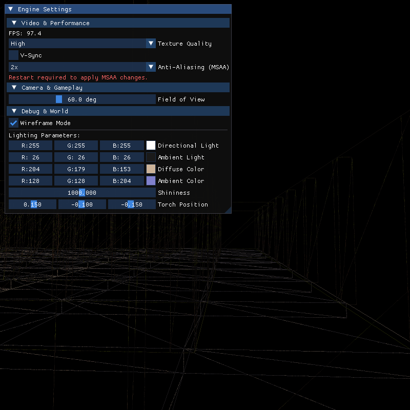

### Stage 10 (v0.11.x)

* **Aggiunte:** Minimappa HUD in sovraimpressione per agevolare l'orientamento, con opzioni di zoom e rotazione configurabili.
* **Soluzioni Tecniche:**
  1. **Shader Unlit:** Telecamera ortografica dedicata e shader specifico privo di illuminazione per ridurre il carico.
  2. **Distance Culling:** Rendering limitato ai soli nodi visibili entro il raggio della mappa.
  3. **MSAA FBO:** Rendering *off-screen* isolato in un Multisampled Framebuffer Object per garantire bordi smussati alla UI senza forzare il costoso MSAA su tutta la scena 3D.
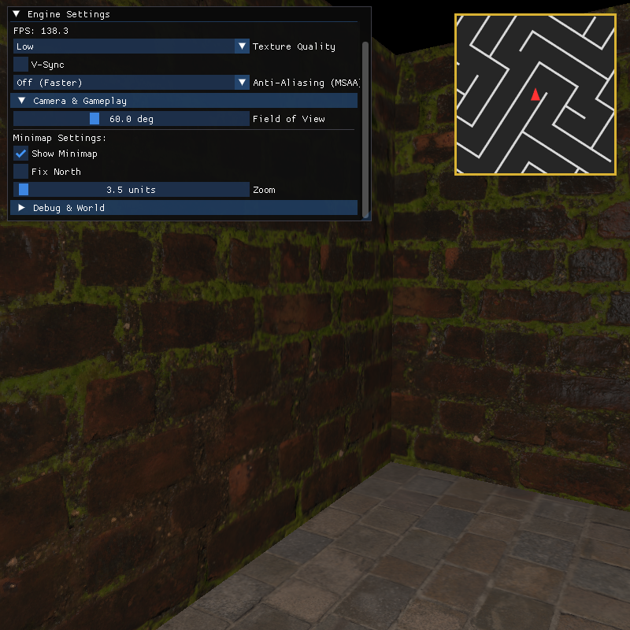

### Stage 11 (v0.12.x)

* **Aggiunte:** Refactoring architetturale del sistema di caricamento asincrono degli asset.
* **Soluzioni Tecniche:** Transizione da switch *hardcoded* a una **Task Queue** basata sul *Command Pattern*. La classe `AssetLoader` gestisce il caricamento via lambda e `std::function`, ottimizzando la memoria tramite *move semantics* (`std::move`).

### Stage 12 (v0.13.x)

* **Aggiunte:** Salto prestazionale estremo (+5x FPS) tramite alleggerimento del sovraccarico CPU nel disegno della geometria.
* **Soluzioni Tecniche:** Implementazione dello **Static Batching** (Mesh Merging). I nodi separati di pavimenti e muri vengono fusi a livello software in fase di avvio, riducendo le migliaia di richieste di disegno dell'intero labirinto a sole **due *Draw Calls* globali**.

### Stage 13 (v0.14.x)

* **Problemi Risolti:** Artefatti visivi su minimappa e font sfocati causati dall'MSAA; movimento anomalo del giocatore in background.
* **Soluzioni Tecniche:**
  1. Risolto il problema MSAA "appiattendo" l'immagine tramite *blitting* su un Resolve Framebuffer prima del render su schermo, disabilitando temporaneamente `GL_MULTISAMPLE` per i testi ImGui.
  2. Vincolato il *polling* della tastiera al solo stato di focus attivo della finestra.
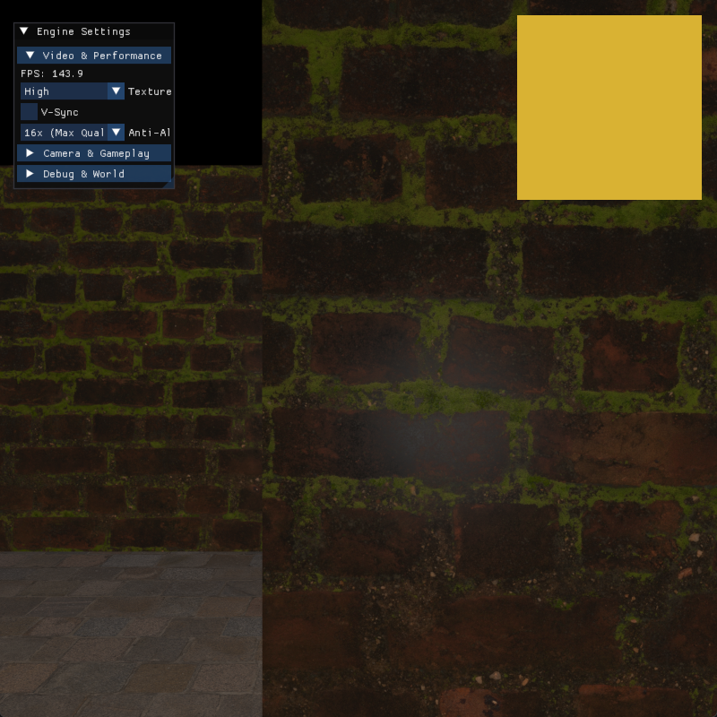

### Stage 14 (v0.15.x)

* **Aggiunte:** Atmosfera dark-fantasy tramite nuovi materiali e nuova calibrazione dell'illuminazione (luce direzionale calda, ambientale fredda).
* **Soluzioni Tecniche:** Disaccoppiamento di luci e materiali. Implementazione del caching delle variabili *uniform* (`MaterialLocations`) nei nodi base dello *Scene Graph* per limitare le chiamate ad OpenGL durante il render loop. Configurazione delle costanti fisiche tramite *designated initializers* (C++20).
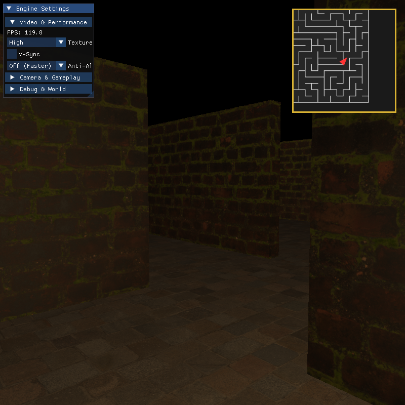

### Stage 15 (v0.16.x)

* **Aggiunte:** Collisioni ambientali e meccanica di corsa (moltiplicatore velocità legato al *delta-time*).
* **Soluzioni Tecniche:** Rilevamento intersezioni basato su **AABB (Axis-Aligned Bounding Box)**. Il calcolo delle collisioni è stato separato per asse (X e Z): in caso di impatto viene bloccata solo la coordinata incriminata, permettendo al giocatore di "scivolare" fluidamente lungo le pareti.

### Stage 16 (v0.17.x)

* **Aggiunte:** Obiettivo di gioco (raggiungere l'uscita), spawn system, cristallo di fine livello e modale di Vittoria con logica di riavvio.
* **Soluzioni Tecniche:** L'animazione del cristallo sfrutta il *delta-time* con wrapping angolare per evitare perdita di precisione in virgola mobile. Introduzione dei **Material Flags**: tramite un uniform `useTextures`, gli Uber Shader ignorano UV e mapping testuale per il cristallo, ottimizzandone il rendering come solido puro illuminato.
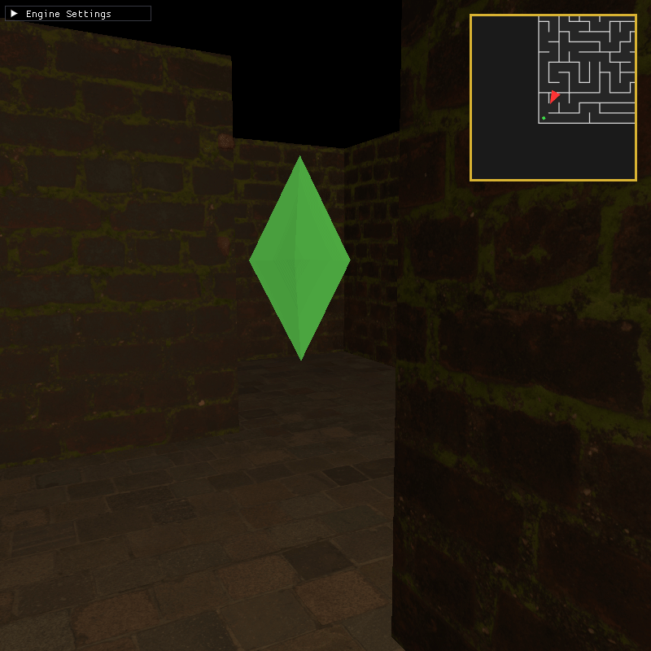
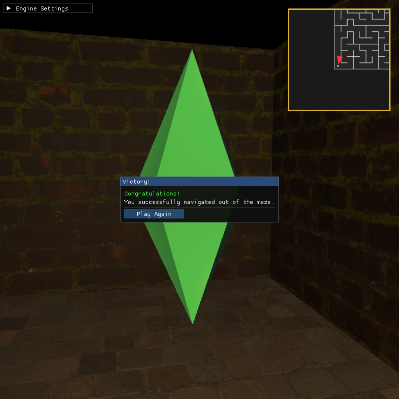

### Stage 17 (v0.18.x)

* **Aggiunte:** Tracciamento prestazioni del giocatore, cristallo traslucido e salvataggio dei record su disco.
* **Soluzioni Tecniche:** Abilitato l'Alpha Blending nativo di OpenGL. Sviluppo del `SessionManager` per gestire il timer (con pausa automatica in caso di perdita focus) e serializzare su file di testo il tempo di completamento, strettamente associato al seme generazionale (*seed*) della partita.
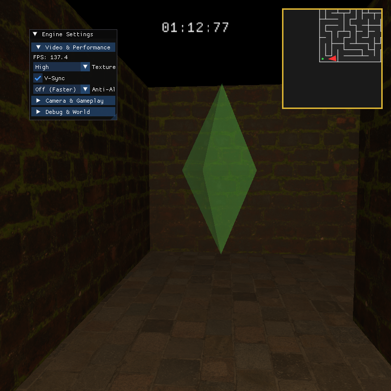

### Stage 18 (v0.19.x)

* **Aggiunte:** Consolidamento della pipeline grafica in un singolo **Uber Shader** (`standard.vert/frag`).
* **Soluzioni Tecniche:** La transizione tra ombreggiatura piatta e smussata fotorealistica avviene ora a *runtime* tramite la variabile `useFlatShading`, abbattendo i cambi di contesto (`glUseProgram`). Micro-ottimizzazioni in *screen-space* (derivate `dFdx/dFdy` calcolate solo se richieste) per la riduzione dei campionamenti VRAM.
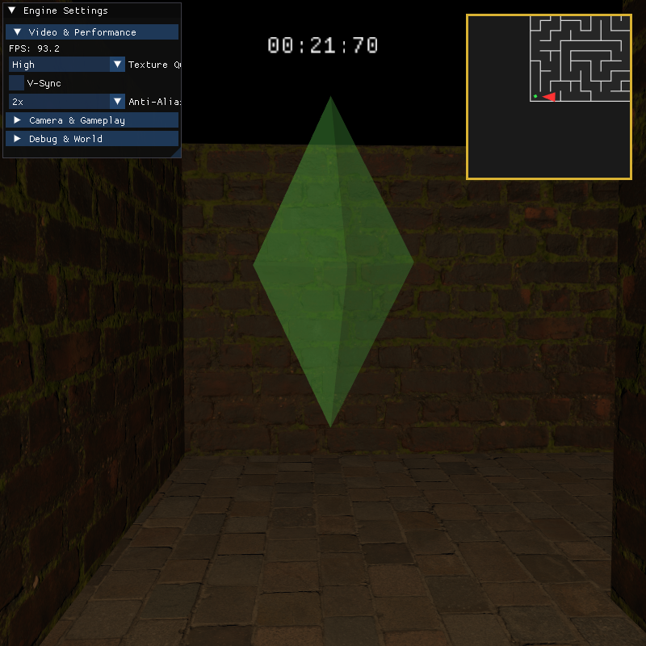

### Stage 19 (v0.20.x)

* **Aggiunte:** Implementazione dei controlli da FPS moderno, stato formale di Pausa (tasto `ESC`) e refactoring del game loop principale.
* **Soluzioni Tecniche:** Il sistema **True FPS Camera** nasconde il cursore e lo blocca al centro della finestra a ogni frame, calcolandone il delta di spostamento per permettere una rotazione visiva a 360° fluida e ininterrotta.

### Stage 20 (v0.21.x)

* **Aggiunte:** Restyling UI con *Dark Theme* custom (angoli smussati e spaziature), riorganizzazione menu Pausa a schede (*Tabs*) bloccato centralmente e Overlay FPS indipendente su schermo.
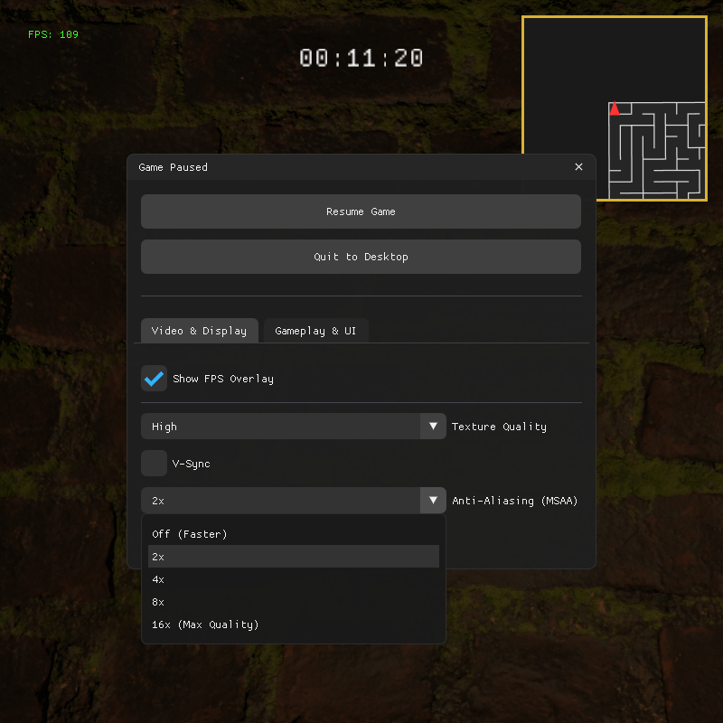

### Stage 21 (v0.22.x)

* **Aggiunte:** Menu Principale (idle rendering), inserimento Seme Personalizzato (*Custom Seed*) e Leaderboard dei migliori 50 tempi.
* **Soluzioni Tecniche:** Lettura e ordinamento automatico (tramite `std::range::sort`) del file di testo locale contenente i record del Session Manager e rendering tramite API tabellari di ImGui.
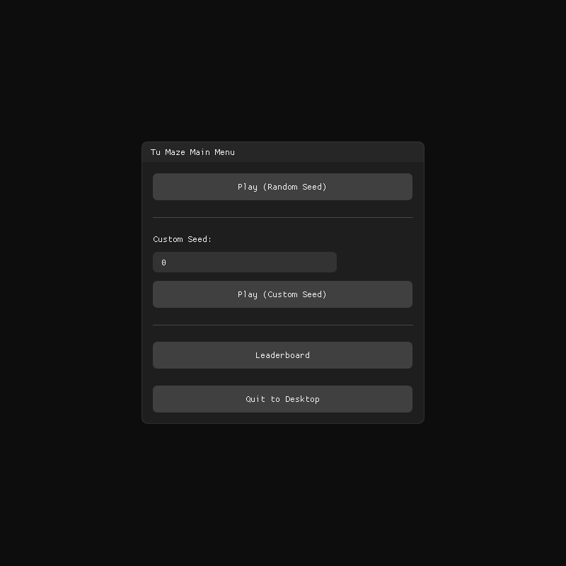
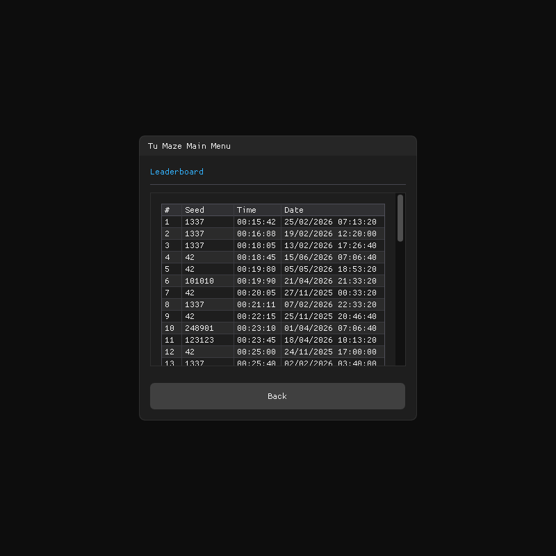

### Stage 22 (v0.23.x)

* **Aggiunte:** Integrazione delle impostazioni video e HUD direttamente nel Menu Principale.
* **Soluzioni Tecniche:** Prevenzione della duplicazione del codice astraendo la logica di disegno in `renderSettingsContent`, componente riutilizzabile sia *in-game* che fuori.

### Stage 23 (v0.24.x)

* **Aggiunte:** Ritenzione dello stato per il pulsante "Play Again" (mantiene il seed personalizzato) e refactoring delle callback dell'interfaccia.
* **Soluzioni Tecniche:** Risoluzione di un *code smell* (firme metodi troppo lunghe) tramite il **Parameter Object Pattern**. Le callback lambda (avvio, uscita, ecc.) sono state raggruppate in un'unica struttura `GuiCallbacks`, migliorando la scalabilità del codice.

### Stage 24 (v0.25.x)

* **Aggiunte:** Profonda ottimizzazione CPU (rimozione calcoli ridondanti e cambi stato GPU).
* **Soluzioni Tecniche:**
  1. **Spatial Caching:** Centri e raggi delle mesh calcolati in avvio e cachati, azzerando le estrazioni matriciali nei controlli di culling.
  2. **State Sorting:** Binding di texture e uniform applicato *solo* se il materiale cambia rispetto al nodo precedente.
  3. **Spatial Partitioning (Collisioni):** Test AABB eseguiti non più su 9 celle limitrofe, ma dinamicamente da 1 a 4 celle sfruttando la posizione frazionaria del giocatore e il suo raggio d'ingombro.

### Stage 25 (v0.26.x)

* **Aggiunte:** Miglioramento del *Game Feel* e interattività ambientale.
* **Soluzioni Tecniche:** Interpolazione lineare (*Lerp*) del FOV durante lo scatto (Dynamic Sprint FOV); modulazione sinusoidale parametrica sull'asse Y per simulare il peso corporeo durante il movimento (Head-Bobbing); gestione interattiva dell'uniform shader della luce per accendere/spegnere la torcia tramite `F`.

### Stage 26 (v0.27.x)

* **Aggiunte:** Selettore difficoltà (scalabilità dimensioni labirinto da 10x10 a 40x40) e aggiornamento Leaderboard.
* **Soluzioni Tecniche:** Categorizzazione dei record in Leaderboard tramite *Tab Bar* separate per difficoltà.
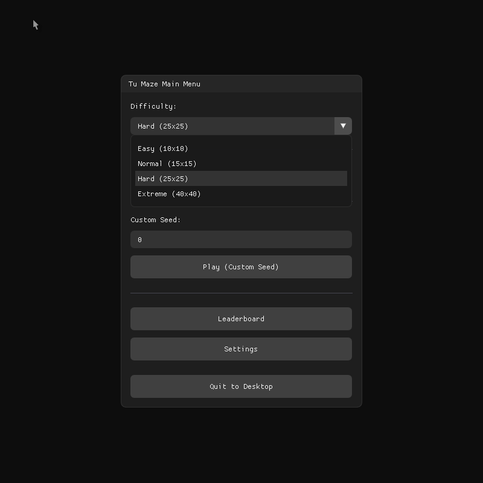
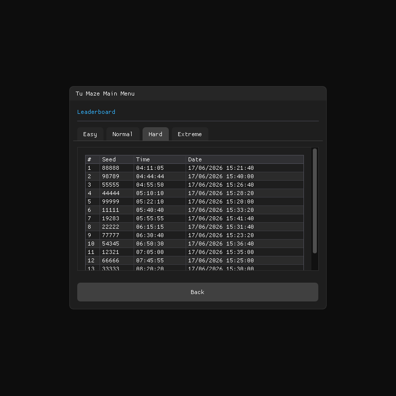

### Stage 27 (v0.28.x)

* **Aggiunte:** Eseguibile di livello *Production Ready* su Windows con icona e metadati ufficiali.
* **Soluzioni Tecniche:** Integrazione gestita a livello *build system*. Uno script CMake compila un Resource File (`.rc`) contenente le info di build e lo collega nativamente all'eseguibile `.exe`, in modo totalmente trasparente e cross-platform (ignorato su Linux/macOS).

### Stage 28 (v0.29.x)

* **Problemi Risolti:** *Stuttering* su macOS causato dalla telemetria del mouse; limiti di rendering su schermi ad alta densità (Retina); spigoli vivi nella minimappa.
* **Soluzioni Tecniche:**
  1. Filtraggio logico degli eventi: il motore ora ignora l'evento sintetico generato dal ricentramento del cursore, processando solo l'input fisico dell'utente.
  2. Risoluzione della minimappa MSAA in Texture OpenGL passata a ImGui per delegare la scalatura corretta.
  3. Stampa manuale sulla `DrawList` di ImGui per smussare gli angoli della minimappa in HUD.

### Stage 29 (v0.30.x)

* **Aggiunte:** Accessibilità e Quality of Life (QoL) nel menu impostazioni.
* **Soluzioni Tecniche:** Parametrizzazione tramite GUI della sensibilità del mouse (moltiplicatore sulla telecamera) e dell'intensità dell'Head-Bobbing, utile per attenuare gli effetti legati alla cinetosi (*motion sickness*).

### Stage 30 (v0.31.x)

* **Aggiunte:** Consolidamento standard C++ moderno.
* **Soluzioni Tecniche:** Transizione direttive macro a `#pragma once`. Incapsulamento totale degli stati, adozione di eccezioni fortemente tipizzate per la gestione errori e sostituzione dei cast memoria pericolosi con il più sicuro `std::bit_cast` introdotto in C++20. Revisione dei commenti dal "cosa fa" al "perché lo fa".

### Stage 31 (v1.0.x)

* **Aggiunte:** Refactoring architetturale a moduli (abbandono dell'approccio *header-only*) e ottimizzazione tempi di compilazione.
* **Soluzioni Tecniche:** Separazione interfaccia/implementazione in `.hpp`/`.cpp`. Classe monolitica `Gui` divisa in componenti isolati (*Separation of Concerns*). Risoluzione di crash legati alle API grafiche isolando i puntatori OpenGL nel file dedicato `glad.cpp`, rispettando la *One Definition Rule* (ODR).

### Stage 32 (v1.1.x)

* **Aggiunte:** Pulizia visiva delle impostazioni.
* **Soluzioni Tecniche:** L'eccessivo caricamento visivo del pannello impostazioni è stato snellito espandendo la *Tab Bar* in tre sezioni logiche: Video & Display, Controls & Camera, e Minimap.

---

## Crediti e Risorse Esterne

Lo sviluppo del progetto è stato affiancato dall'intelligenza artificiale **Gemini** per la consulenza architetturale in C++ moderno, il refactoring delle logiche e la risoluzione dei *Code Smells* individuati dalla pipeline **SonarQube**.

### Soluzioni Tecniche di Base

* **Generazione labirinto:** Visita DFS randomizzata iterativa (stack) basata sulla [documentazione Wikipedia](https://en.wikipedia.org/wiki/Maze_generation_algorithm#Iterative_implementation_(with_stack)).
* **Box Mapping:** Sostituto ottimizzato del mapping triplanare. Documentazione su [Wikipedia - Box Mapping](https://en.wikipedia.org/wiki/Texture_mapping#Box_mapping).
* **Frustum Culling:** Matematica delle intersezioni AABB adattata dagli studi tecnici di [LearnOpenGL](https://learnopengl.com/Guest-Articles/2021/Scene/Frustum-Culling) e [Bruop](https://bruop.github.io/frustum_culling/).
* **Collisioni:** Geometria AABB studiata su [LearnOpenGL](https://learnopengl.com/In-Practice/2D-Game/Collisions/Collision-detection).
* **Distance Culling (Minimappa):** Ottimizzazione basata su distanza euclidea radiale bidimensionale senza l'uso di radici quadrate.

### Codice e Asset

* **Template Iniziale:** Evoluzione diretta del codice base del [Lab7](https://github.com/Tugamer89/FCG/tree/main/Lab7) del corso [FCG](https://github.com/Tugamer89/FCG).
* **Texture PBR:** Materiali CC0 [`cobblestone_pavement`](https://polyhaven.com/a/cobblestone_pavement) e [`mossy_brick`](https://polyhaven.com/a/mossy_brick) reperiti su [PolyHaven](https://polyhaven.com).
